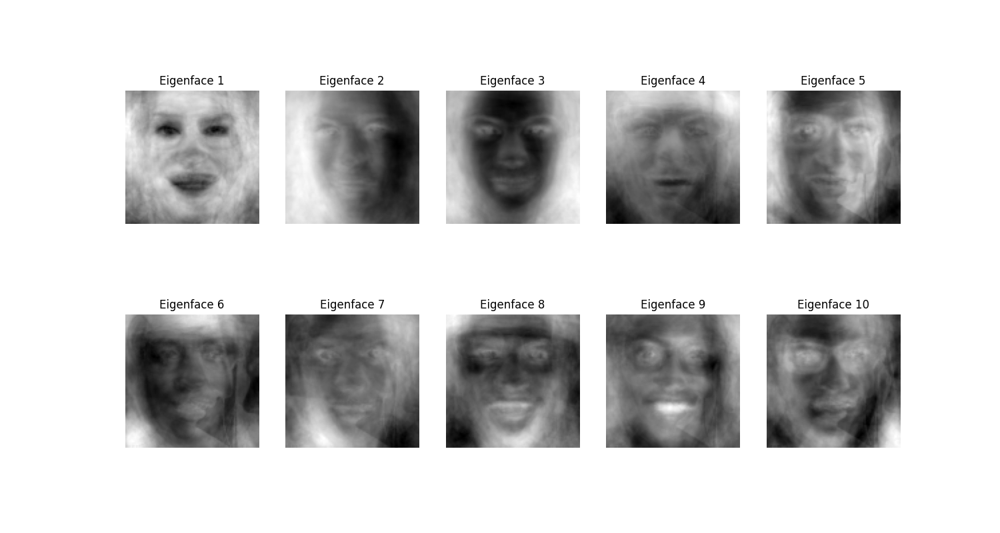

# Eigenface Facial Recognition

## Overview

I built this project to learn more about the basics of facial recognition through a traditional approach like Eigenfaces using Principal Component Analysis (PCA). By employing PCA, we extract the directions and magnitude of variance in facial images to determine the most significant features for distinguishing between faces. The Eigenfaces representing these features are visualized between runs and dimensionality of the data is reduced to preserve the most important information necessary for Support Vector Machine (SVM) classification tasks, in this case, predicting celebrity identities.

## Programs

1. `extractor2.py`

- Reads the urls from `IMDb-Face.csv`.
- Downloads celebrity images from IMDb and organizes them into a local directory.

2. `process6.py`

- Uses dlib's CNN based face detector and shape predictor models for facial alignment.
- PCA performed to generate Eigenfaces and reduce dimensionality.
- SVM classifier trained for actor recognition.

## Requirements

Python v3 or higher

CUDA: v12.6

cuDNN compatible with CUDA v12.6

## Dependencies

`pip install pandas numpy scikit-learn matplotlib dlib joblib tqdm opencv-python cmake`
